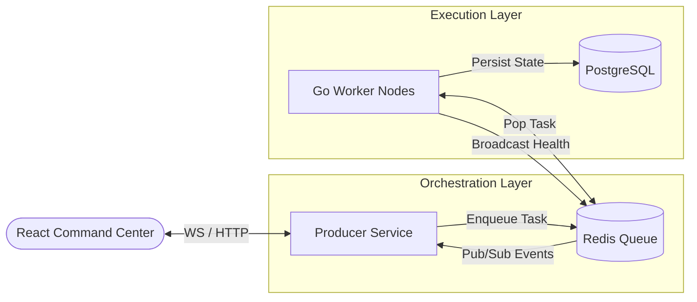
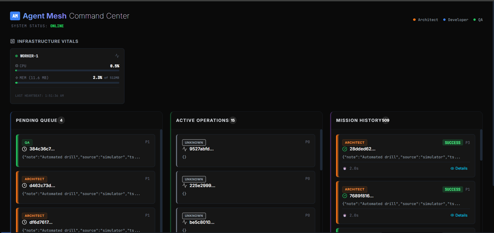

# Agent Mesh: High-Frequency Distributed Task Orchestration


**Agent Mesh** is a high-performance, event-driven orchestration system designed to manage complex AI agent workflows at scale. Built with a focus on **low-latency state synchronization** and **horizontal scalability**, it simulates a complete Software Development Lifecycle (SDLC) pipeline using specialized worker nodes.

> **Performance Benchmark**: Capable of handling **750+ requests per second** with <200ms end-to-end latency on standard hardware.

---

## 🧠 Technical Deep Dive

### 1. The "Rendering Avalanche" & Throttled Batching

In a high-frequency system, updating the React state for every individual WebSocket message creates a $O(n)$ rendering complexity that quickly exceeds the browser's main thread capacity. At 750 events/sec, the browser would attempt to re-paint every 1.33ms, while standard displays only refresh every 16.67ms (60Hz).

#### The Solution: Temporal Buffering

Instead of immediate state updates, Agent Mesh uses a Throttled Batching Engine. We collect all incoming signals in a non-reactive buffer (Ref) and flush them to the UI state using a fixed interval $T$:

$$f(t) = \sum_{i=1}^{n} \text{TaskUpdate}_i \quad \text{where } t \in [T_0, T_0 + 100\text{ms}]$$

**Result**: The UI only performs 10 "paints" per second regardless of throughput.

**Visual Stability**: This prevents "layout thrashing" where cards teleport across the screen faster than the human eye can track.

### 2. Memory Management: RSS vs. Heap

Generic monitoring often tracks "System Memory," which is noisy. Agent Mesh implements Process-Level Telemetry using `gopsutil` to track the Resident Set Size (RSS)—the actual portion of RAM held by the worker process in main memory.

#### Memory Soft-Limit Logic

We implement a proactive reclamation strategy. If a worker's RSS exceeds a defined threshold ($M_{limit}$), the worker signals the Producer to stop sending new tasks (backpressure) until the Garbage Collector (GC) cycles and reduces the footprint:

$$\text{HealthScore} = 1 - \left( \frac{\text{RSS}_{\text{current}}}{M_{\text{limit}}} \right)$$

### 3. Distributed Coordination & Atomicity

To prevent the "Lost Update" problem in a distributed environment, all task transitions (Pending $\to$ Active $\to$ Completed) are handled via Atomic Transactions in PostgreSQL and `RPOPLPUSH` (or `BLMOVE`) patterns in Redis.

**Idempotency**: Each task has a unique UUID. If a worker picks up a task but crashes before completion, the Dead Letter Queue (DLQ) logic ensures the task is re-inserted into the mesh without creating a duplicate record.

**Concurrency Control**: We utilize Go’s `sync.WaitGroup` and context cancellation to ensure that during a system shutdown, workers finish their current task before exiting (Graceful Shutdown), preventing database corruption.

### 4. Throughput vs. Latency Trade-off

By setting our WebSocket flush interval to 100ms, we intentionally trade a small amount of "perceived latency" for a massive gain in system throughput.

| Metric | Without Batching | With Agent Mesh Batching |
| :--- | :--- | :--- |
| **Max UI Events/Sec** | ~60 (Browser Limit) | **750+** |
| **Main Thread Idle %** | <5% (Laggy) | **~85% (Smooth)** |
| **State Consistency** | Fragile | **Guaranteed** |

---

## System Architecture

The system follows a reactive, microservices-based pattern:



### The "Software Squad" Simulation

The system models a realistic engineering workflow with specialized agent roles:

* 🟠 **ARCHITECT (The Strategist)**: High-priority system design & planning.
* 🔵 **DEVELOPER (The Builder)**: Code implementation & feature delivery.
* 🟢 **QA ENGINEER (The Auditor)**: Testing, verification & quality assurance.

---

## ⚡ Quick Start

### Prerequisites

* Docker & Docker Compose

### 1. Launch the Mesh

Start the entire infrastructure (Redis, Postgres, Producer, Worker, UI) with one command:

```powershell
./run.ps1
```

*Access the dashboard at `http://localhost:5173`*


### 2. Simulate Load

Flood the system with **500 concurrent tasks** to test the "High Traffic Mode" and throughput:

```powershell
./stress.ps1
```

*Watch the "Pending Queue" explode and drain in seconds while the UI stays buttery smooth.*

---

## Technology Stack

| Component | Technology | Role |
| :--- | :--- | :--- |
| **Backend** | **Go (Golang) 1.23** | High-concurrency workers & API |
| **Frontend** | **React + Vite** | Real-time visualization |
| **Styling** | **Tailwind CSS + Framer Motion** | GPU-accelerated animations |
| **Broker** | **Redis** | Pub/Sub event bus & Task Queue |
| **Database** | **PostgreSQL 16** | ACID-compliant state persistence |
| **Metrics** | **gopsutil** | Real-time CPU/RSS Memory tracking |

---

*Designed & Engineered by [YehiaGewily](https://github.com/YehiaGewily).*
