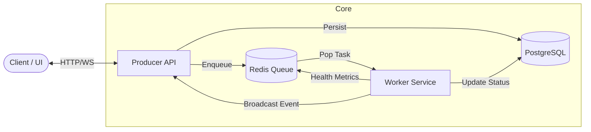

# Agent Mesh Command Center

**Agent Mesh** is a high-performance distributed task orchestration system designed to manage and visualize AI agent operations in real-time. It combines a robust Go backend with a modern React/Vite dashboard to track task lifecycles, health metrics, and agent performance.


---

## Key Features

* **Real-Time Visualization**: A "Command Center" dashboard (React + Tailwind + Framer Motion) showing tasks moving through Pending, Active, and History states.
* **Infrastructure Vitals**: Live monitoring of worker health (CPU & RAM usage), broadcast via WebSockets.
* **Distributed Architecture**: Decoupled Producer, Broker (Redis), and Worker services for horizontal scalability.
* **Reliability**: ACID persistence with PostgreSQL, Dead Letter Queues (DLQ), and exponential backoff strategies.
* **Event-Driven**: Full WebSocket integration for immediate UI updates on task creation, status changes, and completion.

---

## Architecture



### The Squad (Agents)

The system is pre-configured with specialized agents, each visually distinct in the UI:

* **MAGNUS_STRATEGIST** (Blue): High-priority strategic tasks.
* **CEDRIC_WRITER** (Green): Content generation.
* **LYRA_AUDITOR** (Purple): Security and data auditing.

---

## Tech Stack

* **Backend**: Go (Golang) 1.22+
* **Frontend**: React 18, Vite, Tailwind CSS, Framer Motion
* **Broker**: Redis (Pub/Sub & Lists)
* **Database**: PostgreSQL 16
* **Communication**: REST API (Task Ingestion) & WebSockets (Real-time Feeds)

---

## Getting Started

### Prerequisites

* Docker & Docker Compose
* Go 1.22+
* Node.js 18+

### 1. Launch Infrastructure

Start Redis and PostgreSQL containers:

```bash
docker-compose up -d
```

### 2. Start the Backend

#### Terminal 1: The Worker (Processes tasks & reports health)

```bash
go run cmd/worker/main.go
```

#### Terminal 2: The Producer (API & WebSocket Server)

```bash
go run cmd/producer/main.go
```

*Note: The API listens on port 8081.*

### 3. Start the Dashboard

#### Terminal 3: Frontend

```bash
cd ui
npm install
npm run dev
```

Open **<http://localhost:5173>** in your browser.

---

## Usage Guide

### Creating Tasks

You can trigger agents using the REST API. The UI will animate specifically based on the **Agent Type**.

**PowerShell Example:**

```powershell
$body = @{
    agent_type = "MAGNUS_STRATEGIST"
    priority   = 1
    payload    = @{ mission = "Analyze Grid Pattern"; sector = "7G" }
} | ConvertTo-Json

Invoke-RestMethod -Method Post -Uri "http://localhost:8081/v1/tasks" -Body $body -ContentType "application/json"
```

### Monitoring Health

The "Infrastructure Vitals" section shows live CPU/RAM usage from your running Go workers. This heartbeat is sent every 2 seconds via the Redis `system_health` channel.

---

## Project Structure

```bash
├── cmd
│   ├── producer          # REST API & WebSocket Hub
│   └── worker            # Task Executor & Health Monitor
├── internal
│   ├── models            # Domain Types (Task, SystemHealth)
│   └── worker            # Core Logic (Loop, Backoff, Metrics)
├── pkg
│   ├── broker            # Redis Pub/Sub Implementation
│   └── database          # Postgres Persistence
├── ui                    # React Dashboard Application
│   ├── src
│   │   ├── components    # Reusable UI (TaskCard, SystemHealth)
│   │   └── Dashboard.tsx # Main Command Center View
│   └── tailwind.config.js
└── docker-compose.yml
```

---

*Built by [YehiaGewily](https://github.com/YehiaGewily) with a focus on Agentic Architectures.*
